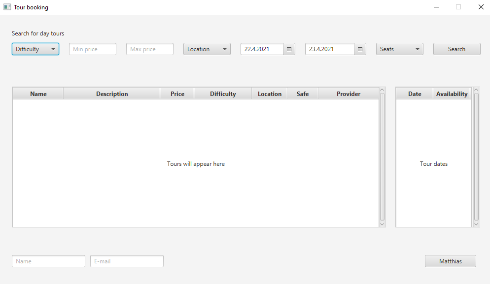
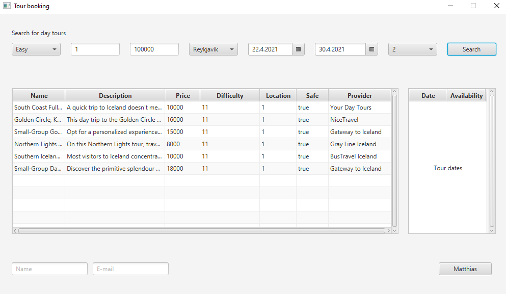
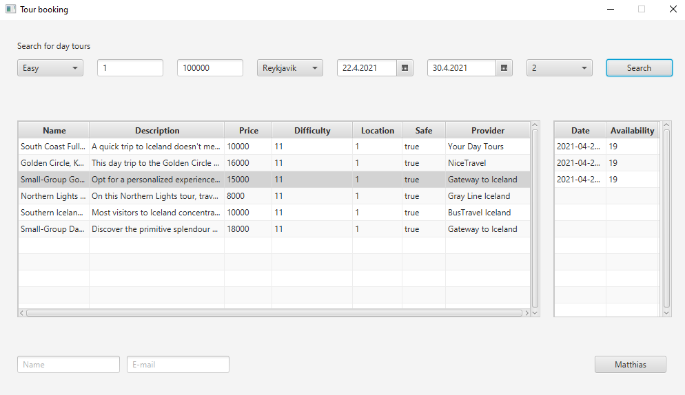
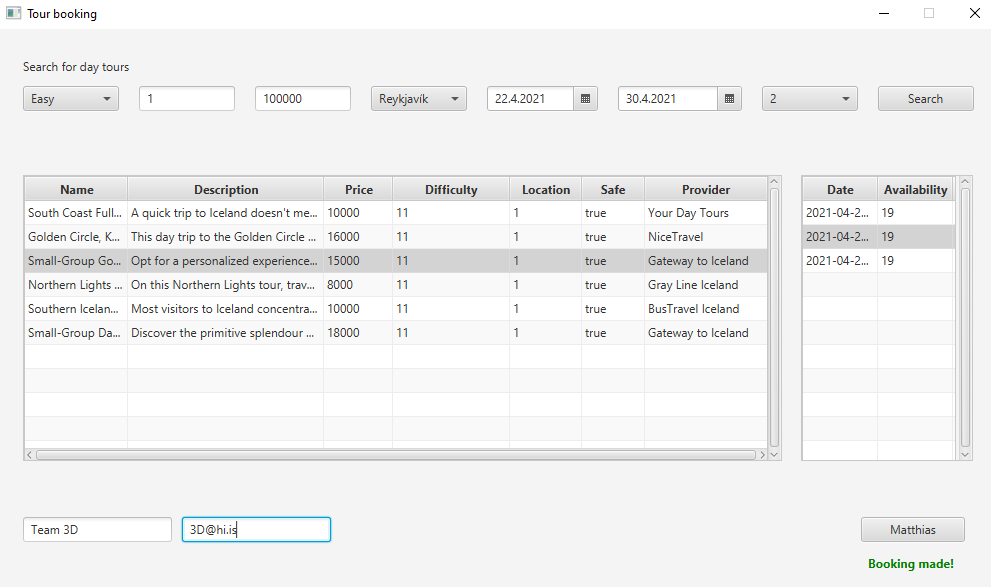

# Day tours - group 3D
## Authors:
* Guðrún Herdís Arnarsdóttir - gha18@hi.is - gha18
* Marcelo Felix Audibert - mfa5@hi.is - Gitcelo
* Marzuk Ingi Lamsiah Svanlaugar - mil4@hi.is - Marzuklngi
* Natanel Demissew Ketema - ndk1@hi.is - natidemis

***

## Packages
#### *Can all be found under the src folder*
* **Controller**: Contains the programs responsible for handling user requests
* **Model**: Contains programs that represent the application
* **Application**: Contains the Parameters class from team 3T and a class that contains commonly used methods between
  classes  
* **data**: Contains the database and programs that set up and do queries on the database
  * The programs that do the queries are used by the programs in the Controller package
* **fakeData**: Contains two .txt files with fake data for the database  
* **vidmot**: Contains a UI for the searching and booking methods (still under construction)

***

## Dependencies
* **JavaFX**: How to set up JavaFX in IntelliJ and a link to download it can be found here
  https://www.jetbrains.com/help/idea/javafx.html
* **JDBC-sqlite**: Can be downloaded from here https://dbschema.com/jdbc-driver/Sqlite.html

***

## Database setup
* To create a new database run `MakeDatabase.java` in the data package from the parent directory of src
  (here Tour)
    * When MakeDatabase is run the .db folder is created and saved in the data package
* To populate the database with fake data run `PopulateDatabase.java` in the data package from the 
  parent directory of src (here Tour)
    * The fake data comes from the .txt files in the package fakeData   

***

## Running the UI

If main is run, the UI below should appear. It uses the two main methods for this project, the search method and
the booking method.

Note that there are no bindings such as for making sure the prices are integers or that all parameters are filled in.
If a parameter is empty or illegal the appplication will throw an error message.

After putting in the search parameters and pressing the search button the results should appear in the table 
like in the example below (note that the table stays empty if there are no results).

To see dates for a tour, the tour should be selected in the tour table and then the dates appear in the dates table
as can be seen below.

After choosing the tour and date, fill in the "Name" and "E-mail" text fields. The value of the "E-mail" text field
must contain one "@" and one "." . To Book press the "Matthias" button.

